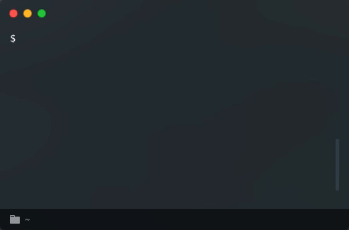

# toggl-day
toggl-day is a CLI tool to show today's Toggl Track summary report.

## Installation

```sh
npm install -g toggl-day
```

## Usage



```
$ toggl-day --help
Show toggl track summary report for the day.

Options:
      --save-token  Save provided token and exit                        [string]
  -d, --date        Specify the date of the report you want to show
                    (format: YYYY-MM-DD)                                [string]
      --no-colors   Disable colors                                     [boolean]
  -v, --version     Show version number                                [boolean]
  -h, --help        Show help                                          [boolean]

Examples:
  toggl-day --save-token fc08b73f24644419d  Save provided token
  toggl-day                                 Show the report for today
  toggl-day -d 2020-12-01                   Show the report for Dec. 1, 2020```
